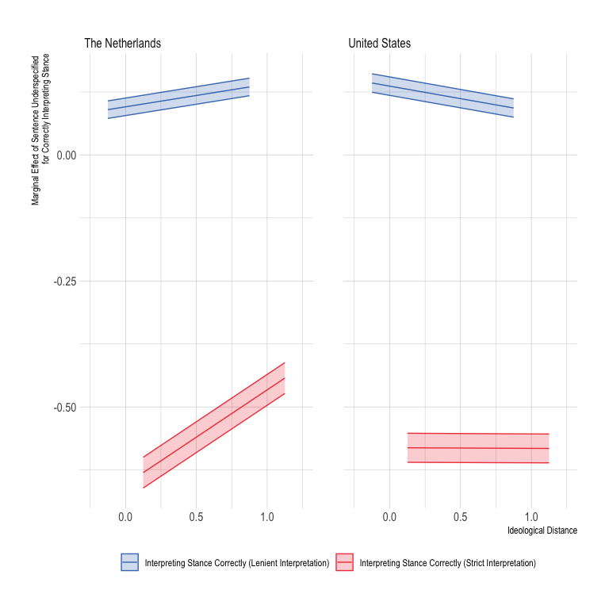
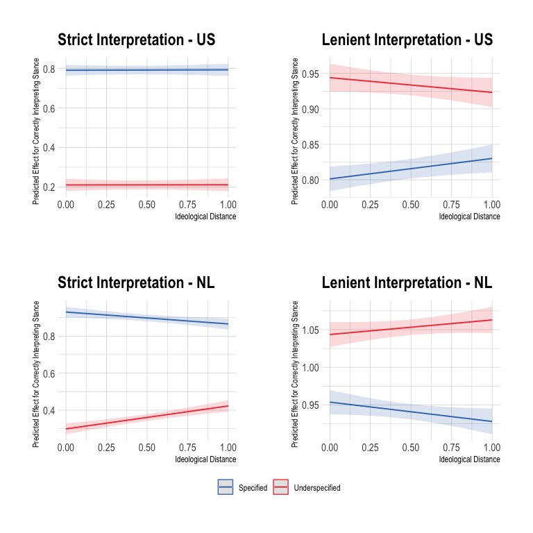
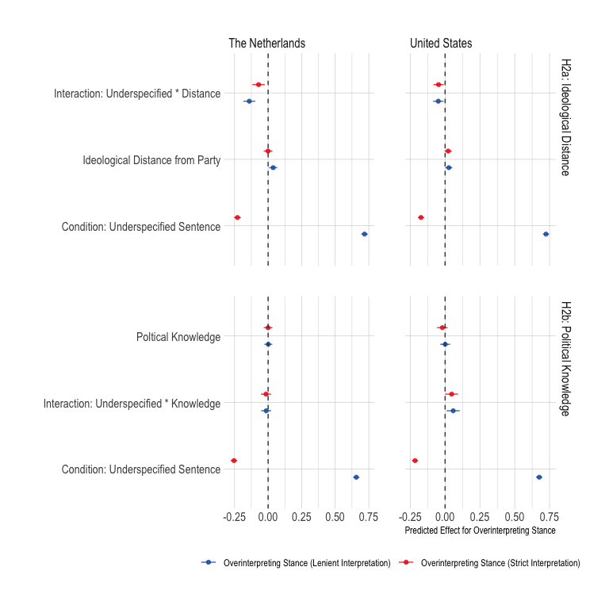
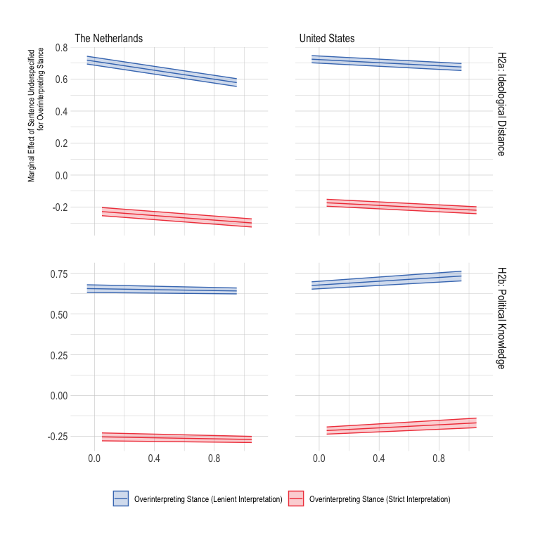
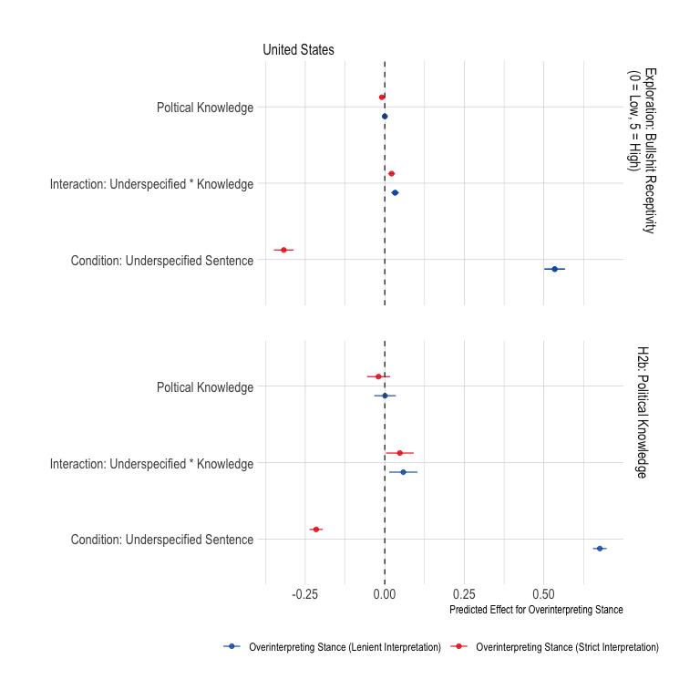
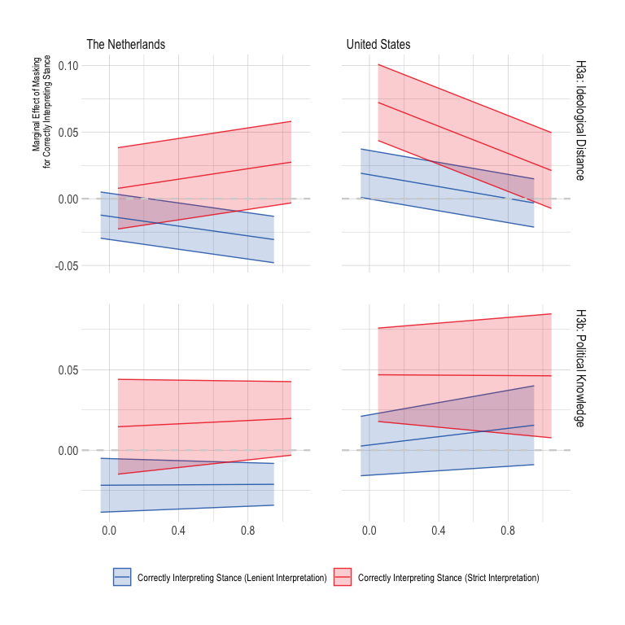
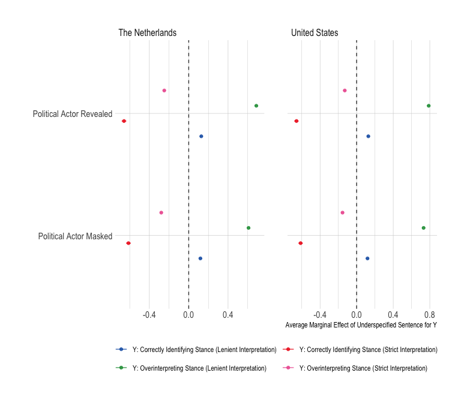
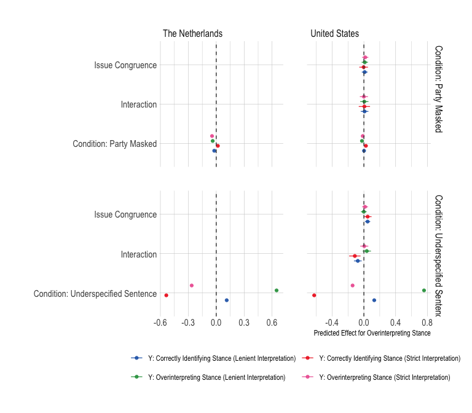
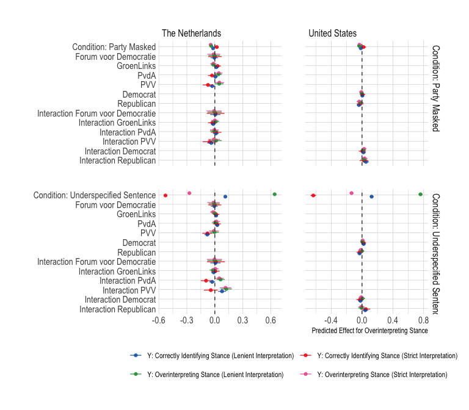

Analyses
================

# Required Packages & Reproducibility

``` r
rm(list=ls())
source(here::here("src/lib/functions.R"))
```

# Analyses

``` r
load(here("data/intermediate/cleaned_data_nl.RData"))
load(here("data/intermediate/cleaned_data_us.RData"))
```

## Balance Checks

The figure below shows that the data is not unbalanced for any of the
variables: As described in the Pre-Analysis Plan (p.10), we will not add
any covariates to the analyses as controls.

``` r
source(here("src/analysis/balance-test.R"))
df
```


## Baseline Model

``` r
source(here("src/analysis/baseline.R"))
b
```


``` r
b_b
```


``` r
source(here("src/analysis/issue_specific.R"))
b_i
```


``` r
b_ib
```


## Ideological Bias hypothesis

``` r
source(here("src/analysis/h1.R"))
p1
```


``` r
p1b
```



``` r
p1 / p1b +
  plot_layout(heights = c(1, 1.3)) + 
  plot_layout(guides = "collect") & theme(legend.position = 'bottom')
```



``` r
p1_2 / p1b2 +
  plot_layout(heights = c(1, 1.3)) 
```


## Overinterpretation Hypotheses

``` r
source(here("src/analysis/h2.R"))
p2
```



``` r
p2b
```



``` r
p2c
```



## Masking Hypothesis

``` r
source(here("src/analysis/h3.R"))
p3
```


``` r
p3b
```



``` r
p3c
```


## Exploration

``` r
source(here("src/analysis/exploration.R"))
p_e1
```


``` r
p_e2
```



``` r
p_e3_1
```



``` r
p_e3_2
```


``` r
p_b
```



``` r
p_b2
```


``` r
source(here("src/analysis/profile_resp.R"))
kbl(e1, booktabs =T, caption = "\\label{tab:conditions}Profile Dutch Stance Annotators") %>%
  kable_styling(latex_options = c("striped", "hold_position"),
                full_width = F, fixed_thead = T, position = "center") %>%
  column_spec(1, width = "7cm") %>%
  column_spec(2, width = "7cm")
```

<table class="table" style="width: auto !important; margin-left: auto; margin-right: auto;">
<caption>
Profile Dutch Stance Annotators
</caption>
<thead>
<tr>
<th style="text-align:left;position: sticky; top:0; background-color: #FFFFFF;">
Incorrectly Identified Stance
</th>
<th style="text-align:left;position: sticky; top:0; background-color: #FFFFFF;">
Correctly Identified Stance
</th>
</tr>
</thead>
<tbody>
<tr>
<td style="text-align:left;width: 7cm; ">
Male
</td>
<td style="text-align:left;width: 7cm; ">
Male
</td>
</tr>
<tr>
<td style="text-align:left;width: 7cm; ">
High-levels of education
</td>
<td style="text-align:left;width: 7cm; ">
High-levels of education
</td>
</tr>
<tr>
<td style="text-align:left;width: 7cm; ">
West of Netherlands
</td>
<td style="text-align:left;width: 7cm; ">
West of Netherlands
</td>
</tr>
<tr>
<td style="text-align:left;width: 7cm; ">
Fulltime Employed
</td>
<td style="text-align:left;width: 7cm; ">
Fulltime Employed
</td>
</tr>
<tr>
<td style="text-align:left;width: 7cm; ">
D66
</td>
<td style="text-align:left;width: 7cm; ">
D66
</td>
</tr>
<tr>
<td style="text-align:left;width: 7cm; ">
Age: 48
</td>
<td style="text-align:left;width: 7cm; ">
Age: 46
</td>
</tr>
<tr>
<td style="text-align:left;width: 7cm; ">
Income: 3250
</td>
<td style="text-align:left;width: 7cm; ">
Income: 3250
</td>
</tr>
<tr>
<td style="text-align:left;width: 7cm; ">
Position on Immigration: 3
</td>
<td style="text-align:left;width: 7cm; ">
Position on Immigration: 3
</td>
</tr>
<tr>
<td style="text-align:left;width: 7cm; ">
Position on Environment: 1
</td>
<td style="text-align:left;width: 7cm; ">
Position on Environment: 1
</td>
</tr>
<tr>
<td style="text-align:left;width: 7cm; ">
Position on Tax: 3
</td>
<td style="text-align:left;width: 7cm; ">
Position on Tax: 3
</td>
</tr>
<tr>
<td style="text-align:left;width: 7cm; ">
Position on EU: 1
</td>
<td style="text-align:left;width: 7cm; ">
Position on EU: 1
</td>
</tr>
<tr>
<td style="text-align:left;width: 7cm; ">
Ideological Position: 5
</td>
<td style="text-align:left;width: 7cm; ">
Ideological Position: 4
</td>
</tr>
<tr>
<td style="text-align:left;width: 7cm; ">
Ideological Distance: 2
</td>
<td style="text-align:left;width: 7cm; ">
Ideological Distance: 2
</td>
</tr>
<tr>
<td style="text-align:left;width: 7cm; ">
Issue Congruence: 0
</td>
<td style="text-align:left;width: 7cm; ">
Issue Congruence: 0
</td>
</tr>
<tr>
<td style="text-align:left;width: 7cm; ">
Political Knowledge: 2
</td>
<td style="text-align:left;width: 7cm; ">
Political Knowledge: 2
</td>
</tr>
</tbody>
</table>

``` r
kbl(e1_us, booktabs =T, caption = "\\label{tab:conditions_us}Profile American Stance Annotators") %>%
  kable_styling(latex_options = c("striped", "hold_position"),
                full_width = F, fixed_thead = T, position = "center") %>%
  column_spec(1, width = "7cm") %>%
  column_spec(2, width = "7cm")
```

<table class="table" style="width: auto !important; margin-left: auto; margin-right: auto;">
<caption>
Profile American Stance Annotators
</caption>
<thead>
<tr>
<th style="text-align:left;position: sticky; top:0; background-color: #FFFFFF;">
Incorrectly Identified Stance
</th>
<th style="text-align:left;position: sticky; top:0; background-color: #FFFFFF;">
Correctly Identified Stance
</th>
</tr>
</thead>
<tbody>
<tr>
<td style="text-align:left;width: 7cm; ">
Male
</td>
<td style="text-align:left;width: 7cm; ">
Male
</td>
</tr>
<tr>
<td style="text-align:left;width: 7cm; ">
High-level of education
</td>
<td style="text-align:left;width: 7cm; ">
High-level of education
</td>
</tr>
<tr>
<td style="text-align:left;width: 7cm; ">
Southeast of the United States
</td>
<td style="text-align:left;width: 7cm; ">
Southeast of the United States
</td>
</tr>
<tr>
<td style="text-align:left;width: 7cm; ">
Working now
</td>
<td style="text-align:left;width: 7cm; ">
Working now
</td>
</tr>
<tr>
<td style="text-align:left;width: 7cm; ">
Democrat
</td>
<td style="text-align:left;width: 7cm; ">
Democrat
</td>
</tr>
<tr>
<td style="text-align:left;width: 7cm; ">
Age: 24
</td>
<td style="text-align:left;width: 7cm; ">
Age: 24
</td>
</tr>
<tr>
<td style="text-align:left;width: 7cm; ">
Income: 3250
</td>
<td style="text-align:left;width: 7cm; ">
Income: 3250
</td>
</tr>
<tr>
<td style="text-align:left;width: 7cm; ">
Position on Immigration: 3
</td>
<td style="text-align:left;width: 7cm; ">
Position on Immigration: 3
</td>
</tr>
<tr>
<td style="text-align:left;width: 7cm; ">
Position on Environment: 2
</td>
<td style="text-align:left;width: 7cm; ">
Position on Environment: 2
</td>
</tr>
<tr>
<td style="text-align:left;width: 7cm; ">
Position on Tax: 4
</td>
<td style="text-align:left;width: 7cm; ">
Position on Tax: 4
</td>
</tr>
<tr>
<td style="text-align:left;width: 7cm; ">
Position on Foreign Policy: 3
</td>
<td style="text-align:left;width: 7cm; ">
Position on Foreign Policy: 3
</td>
</tr>
<tr>
<td style="text-align:left;width: 7cm; ">
Ideological Position: 2
</td>
<td style="text-align:left;width: 7cm; ">
Ideological Position: 2
</td>
</tr>
<tr>
<td style="text-align:left;width: 7cm; ">
Ideological Distance: 2
</td>
<td style="text-align:left;width: 7cm; ">
Ideological Distance: 2
</td>
</tr>
<tr>
<td style="text-align:left;width: 7cm; ">
Issue Congruence: 1
</td>
<td style="text-align:left;width: 7cm; ">
Issue Congruence: 0
</td>
</tr>
<tr>
<td style="text-align:left;width: 7cm; ">
Political Knowledge: 1
</td>
<td style="text-align:left;width: 7cm; ">
Political Knowledge: 1
</td>
</tr>
<tr>
<td style="text-align:left;width: 7cm; ">
Bullshit Receptivity: 3
</td>
<td style="text-align:left;width: 7cm; ">
Bullshit Receptivity: 2
</td>
</tr>
</tbody>
</table>
