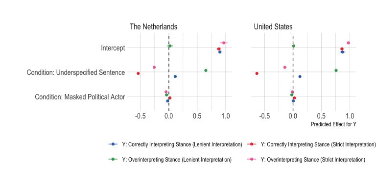
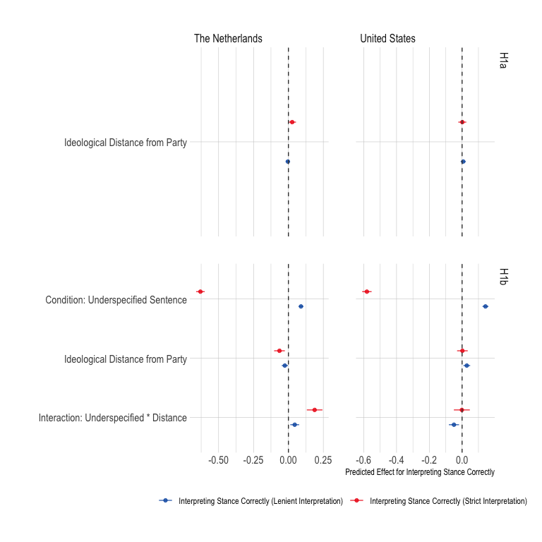
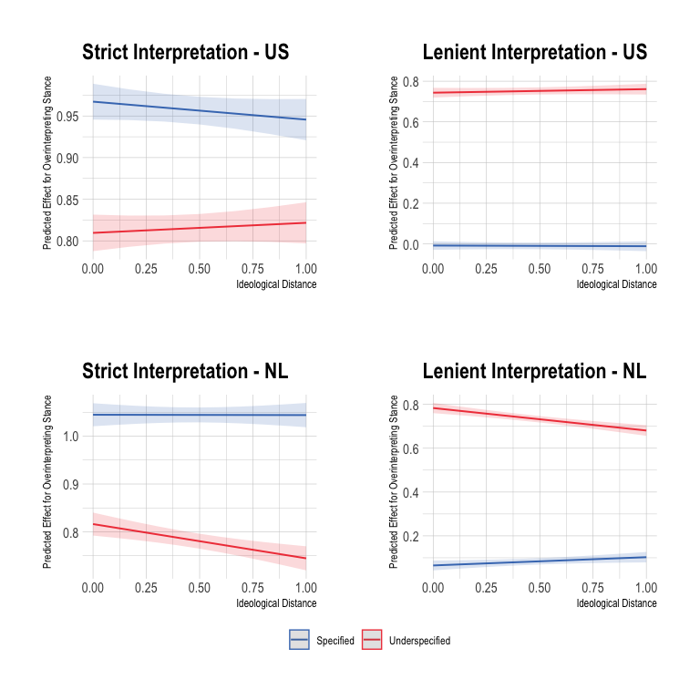
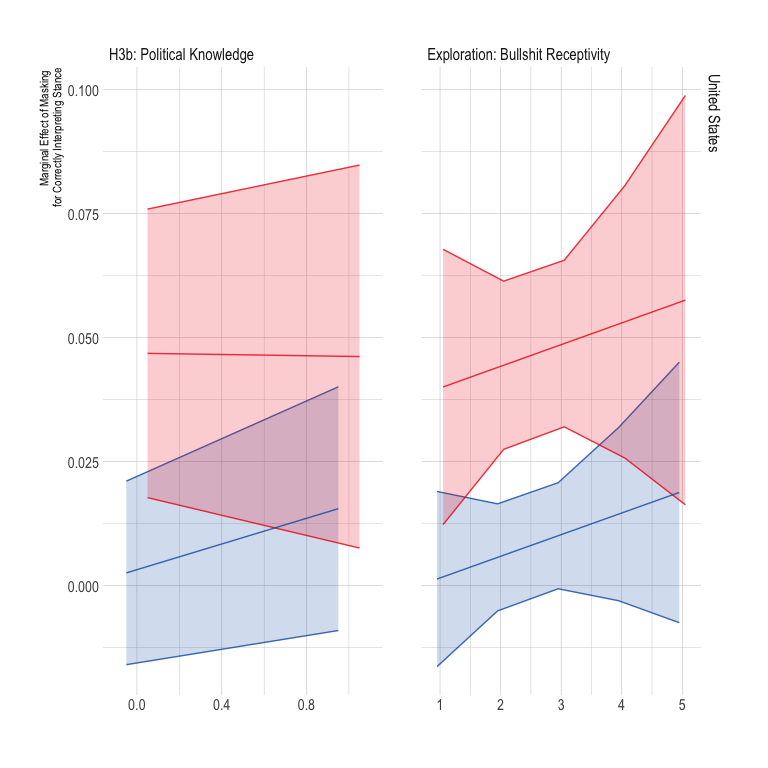
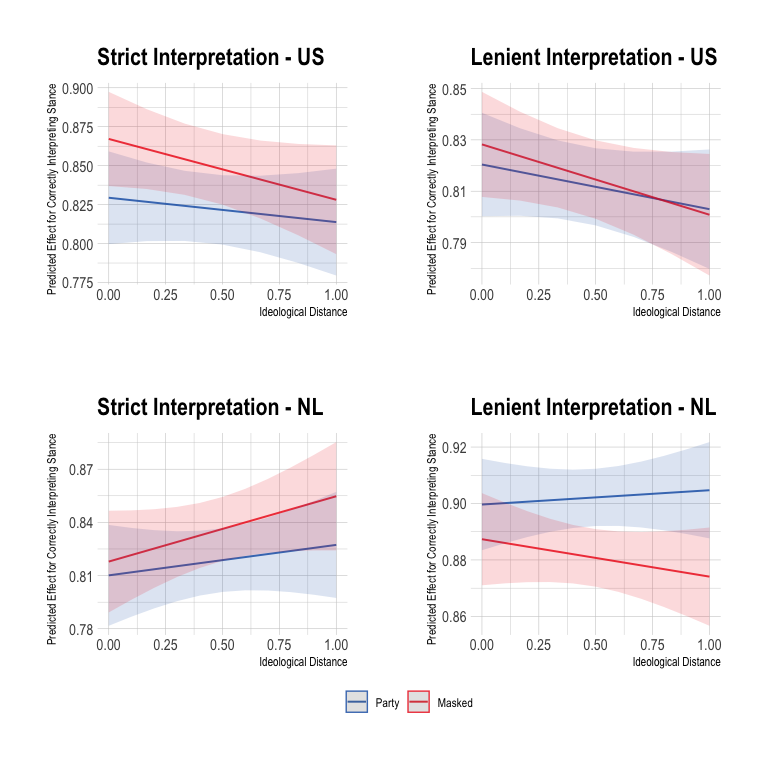
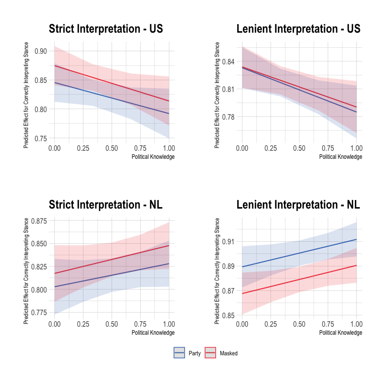
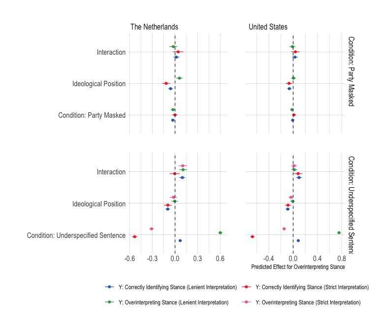

Analyses
================

# Required Packages & Reproducibility

``` r
rm(list=ls())
source(here::here("src/lib/functions.R"))
```

# Analyses

``` r
load(here("data/intermediate/cleaned_data_joined.RData"))
```

## Balance Checks

The figure below shows that the data is not unbalanced for any of the
variables: As described in the Pre-Analysis Plan (p.10), we will not add
any covariates to the analyses as controls.

``` r
source(here("src/analysis/balance-test.R"))
df
```


## Baseline Model

``` r
source(here("src/analysis/baseline.R"))
b
```



``` r
rm(b_b, b1, b2, df, df_nl, df_us, tmp)
```

``` r
source(here("src/analysis/issue_specific.R"))
b_i
```


``` r
rm(b1, b2, df, df_nl, df_us, tmp, issues_nl, issues_us, i)
```

## Ideological Bias hypothesis

``` r
source(here("src/analysis/h1.R"))
p1a
```



``` r
p1b
```


``` r
(p1b_1+p1b_2)/(p1b_3 + p1b_4) + 
  plot_layout(guides = "collect") & theme(legend.position = 'bottom')
```


``` r
rm(df, df_nl, df_us, h1a, h1b, p1b_1, 
   pred1b_1, pred1b_2, pred1b_3, pred1b_4, tmp)
```

## Overinterpretation Hypotheses

``` r
source(here("src/analysis/h2.R"))
p2a
```


``` r
p2b
```


``` r
p2c1
```


``` r
p2c2
```


``` r
(p2a_1+p2a_2)/(p2a_3 + p2a_4) + 
  plot_layout(guides = "collect") & theme(legend.position = 'bottom')
```



``` r
(p2b_1+p2b_2)/(p2b_3 + p2b_4) + 
  plot_layout(guides = "collect") & theme(legend.position = 'bottom')
```


``` r
rm(df, df_nl, df_us, h2a, h2a_2, h2b, h2b_2, tmp, tmpp,
   pred2a_1, pred2a_2, pred2a_3, pred2a_4, 
   pred2b_1, pred2b_2, pred2b_3, pred2b_4)
```

## Masking Hypothesis

``` r
source(here("src/analysis/h3.R"))
p3a
```


``` r
p3b
```


``` r
p3c1
```


``` r
p3c2
```



``` r
(p3a_1+p3a_2)/(p3a_3 + p3a_4) + 
  plot_layout(guides = "collect") & theme(legend.position = 'bottom')
```



``` r
(p3b_1+p3b_2)/(p3b_3 + p3b_4) + 
  plot_layout(guides = "collect") & theme(legend.position = 'bottom')
```



``` r
rm(df, df_nl, df_us, h3a, h3a_2, h3b, 
   h3b_2,h3b_bs, h3b_2bs, tmp, tmpp,
   pred3a_1, pred3a_2, pred3a_3, pred3a_4, 
   pred3b_1, pred3b_2, pred3b_3, pred3b_4)
```

## Exploration

``` r
source(here("src/analysis/exploration.R"))
p_b1
```


``` r
p_b2
```


``` r
p_e1a
```


``` r
p_e1b
```



``` r
source(here("src/analysis/profiles.R"))
prof1 
```


``` r
prof2
```


``` r
source(here("src/analysis/profile_resp.R"))
kbl(e1_nlp, booktabs =T, caption = "\\label{tab:conditions}Profile Dutch Stance Annotators") %>%
  kable_styling(latex_options = c("striped", "hold_position"),
                full_width = F, fixed_thead = T, position = "center") %>%
  column_spec(1, width = "7cm") %>%
  column_spec(2, width = "7cm")

kbl(e1_ss, booktabs =T, caption = "\\label{tab:conditions2}Profile Dutch Stance Annotators") %>%
  kable_styling(latex_options = c("striped", "hold_position"),
                full_width = F, fixed_thead = T, position = "center") %>%
  column_spec(1, width = "7cm") %>%
  column_spec(2, width = "7cm")


kbl(e1_us_nlp, booktabs =T, caption = "\\label{tab:conditions_us}Profile American Stance Annotators") %>%
  kable_styling(latex_options = c("striped", "hold_position"),
                full_width = F, fixed_thead = T, position = "center") %>%
  column_spec(1, width = "7cm") %>%
  column_spec(2, width = "7cm")

kbl(e1_us_ss, booktabs =T, caption = "\\label{tab:conditions_us2}Profile American Stance Annotators") %>%
  kable_styling(latex_options = c("striped", "hold_position"),
                full_width = F, fixed_thead = T, position = "center") %>%
  column_spec(1, width = "7cm") %>%
  column_spec(2, width = "7cm")
```
